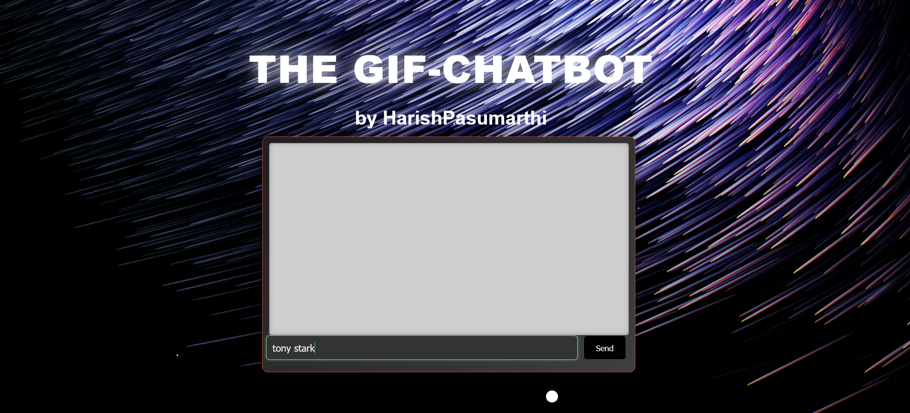
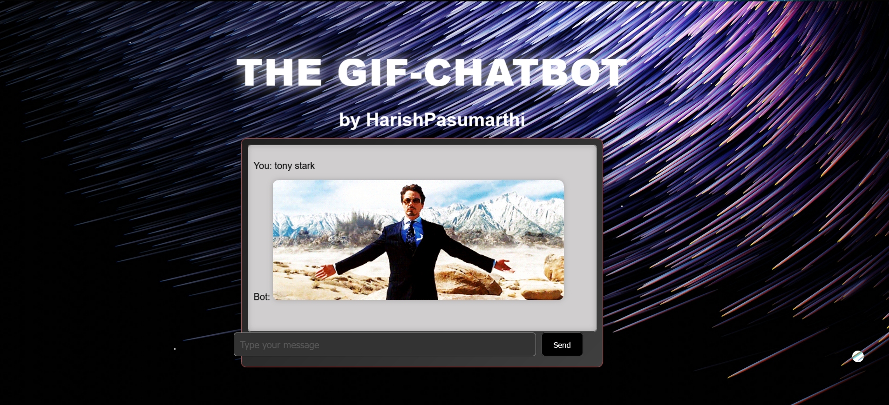

# The GIF-Chatbot

## Project Overview
The **Animated GIF Chatbot** is an interactive web-based chatbot designed to enhance user engagement by responding to messages with relevant animated GIFs. It creates a visually rich and dynamic user experience by incorporating custom animations, sound effects, and a responsive interface.

## Features
- **Custom Background and Parallax Effect:** A visually appealing background with parallax star animations that respond to cursor movements, creating a sense of depth.
- **Custom Cursor Animation:** The cursor is hidden, and special animations are applied for a unique user interaction experience.
- **Real-Time Sound Effects:** Sound effects play when users type in the search bar and send messages, adding an auditory layer of engagement.
- **Animated Chat Interactions:** The chatbot responds to user messages with animated GIFs that match the input text, making conversations more lively.
- **Fallback Text Responses:** If no matching GIF is found, the chatbot responds with a friendly text message.

## Technology Stack
- **HTML**: For structuring the chatbot interface.
- **CSS**: For styling the interface, including animations and custom effects.
- **JavaScript**: For handling user interactions, sound effects, and managing the chatbot's response logic.
- **Flask**: (Assumed from `app.py`) Backend framework for serving the web application.

## Installation

1. **Clone the Repository:**
   ```bash
   git clone https://github.com/yourusername/animated-gif-chatbot.git
   cd animated-gif-chatbot
2. **Set Up a Virtual Environment:**
   ```bash
   python3 -m venv venv
  # On Windows use:  `venv\Scripts\activate`
3. **Install the Required Packages:**
   ```bash
   pip install -r requirements.txt
4. **Run the Flask App:**
   ```bash
   python app.py
5. **open the url generated by flask app**
**usage**
*Chat with the Bot:* Type a message into the chat box and press 'Send'. The bot will respond with a GIF related to your message.
*Interact with the Interface:* Move your cursor around to see the background animation and other interactive effects.

## Screenshots


*Screenshot of the chatbot in action.*

## Contributing
Contributions are welcome! Please feel free to submit a pull request or open an issue to discuss any changes.

## License
This project is licensed under the MIT License. See the [LICENSE](LICENSE) file for more details.

## Contact
- **Author:** Harish Pasumarthi
- **LinkedIn:** [Harish-Pasumarthi](https://www.linkedin.com/in/harish-pasumarthi/)

